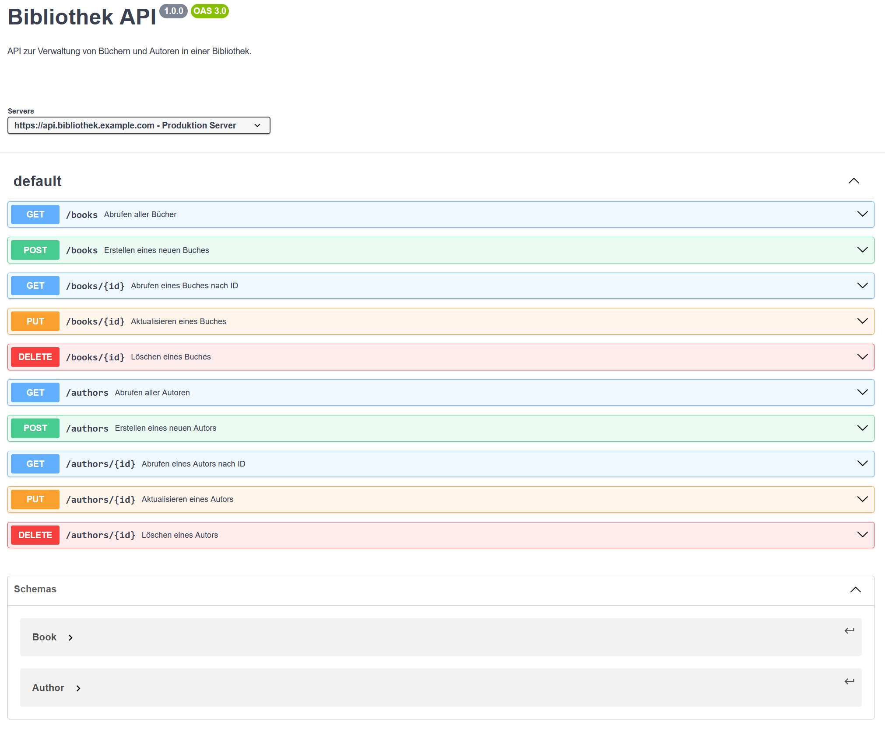
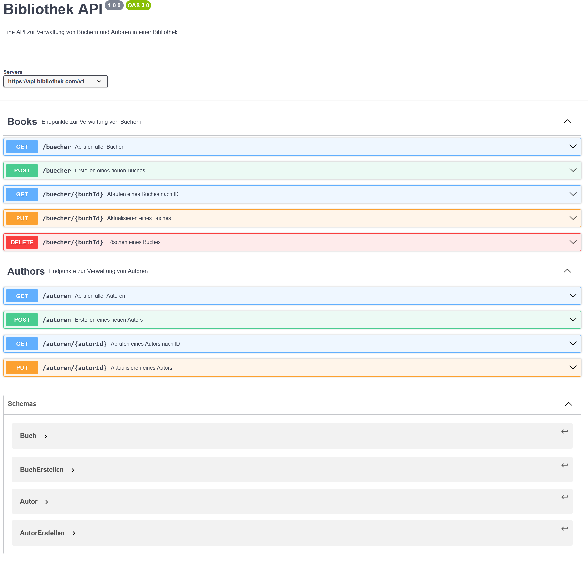

# Schnittstellen Defininition

## Anforderungen

Die Schnittstelle hat folgende Anfroderugen:

### Bücher:

- Abrufen aller Bücher: Eine Liste aller Bücher in der Bibliothek.

- Abrufen eines Buches nach ID: Detaillierte Informationen zu einem bestimmten Buch, einschliesslich Titel, Beschreibung, Veröffentlichungsjahr und der zugehörigen Autoren.

- Erstellen eines neuen Buches: Ein neues Buch mit Titel, Beschreibung, Veröffentlichungsjahr und Autoren hinzufügen.

- Aktualisieren eines Buches: Die Details eines bestehenden Buches aktualisieren.

- Löschen eines Buches: Ein Buch aus der Bibliothek entfernen.

### Autoren:

- Abrufen aller Autoren: Eine Liste aller Autoren in der Bibliothek.

- Abrufen eines Autors nach ID: Detaillierte Informationen zu einem bestimmten Autor, einschliesslich Name, Geburtsdatum und Liste der geschriebenen Bücher.

- Erstellen eines neuen Autors: Einen neuen Autor mit Name und Geburtsdatum hinzufügen.

- Aktualisieren eines Autors: Die Details eines bestehenden Autors aktualisieren.

## ChatGPT

ChatGPT hat die Anforderungen in folgende OpenApi schnittstellendokumentation umgewandelt:

```yaml
openapi: 3.0.0
info:
  title: Bibliothek API
  version: 1.0.0
  description: API zur Verwaltung von Büchern und Autoren in einer Bibliothek.

servers:
  - url: https://api.bibliothek.example.com
    description: Produktion Server

paths:
  /books:
    get:
      summary: Abrufen aller Bücher
      description: Gibt eine Liste aller Bücher in der Bibliothek zurück.
      responses:
        "200":
          description: Erfolgreiche Antwort
          content:
            application/json:
              schema:
                type: array
                items:
                  $ref: "#/components/schemas/Book"
    post:
      summary: Erstellen eines neuen Buches
      description: Fügt ein neues Buch zur Bibliothek hinzu.
      requestBody:
        required: true
        content:
          application/json:
            schema:
              $ref: "#/components/schemas/Book"
      responses:
        "201":
          description: Buch erfolgreich erstellt
          content:
            application/json:
              schema:
                $ref: "#/components/schemas/Book"

  /books/{id}:
    get:
      summary: Abrufen eines Buches nach ID
      description: Gibt detaillierte Informationen zu einem bestimmten Buch zurück.
      parameters:
        - name: id
          in: path
          required: true
          schema:
            type: integer
          description: Die ID des Buches
      responses:
        "200":
          description: Erfolgreiche Antwort
          content:
            application/json:
              schema:
                $ref: "#/components/schemas/Book"
        "404":
          description: Buch nicht gefunden
    put:
      summary: Aktualisieren eines Buches
      description: Aktualisiert die Details eines bestehenden Buches.
      parameters:
        - name: id
          in: path
          required: true
          schema:
            type: integer
          description: Die ID des Buches
      requestBody:
        required: true
        content:
          application/json:
            schema:
              $ref: "#/components/schemas/Book"
      responses:
        "200":
          description: Buch erfolgreich aktualisiert
          content:
            application/json:
              schema:
                $ref: "#/components/schemas/Book"
        "404":
          description: Buch nicht gefunden
    delete:
      summary: Löschen eines Buches
      description: Entfernt ein Buch aus der Bibliothek.
      parameters:
        - name: id
          in: path
          required: true
          schema:
            type: integer
          description: Die ID des Buches
      responses:
        "204":
          description: Buch erfolgreich gelöscht
        "404":
          description: Buch nicht gefunden

  /authors:
    get:
      summary: Abrufen aller Autoren
      description: Gibt eine Liste aller Autoren in der Bibliothek zurück.
      responses:
        "200":
          description: Erfolgreiche Antwort
          content:
            application/json:
              schema:
                type: array
                items:
                  $ref: "#/components/schemas/Author"
    post:
      summary: Erstellen eines neuen Autors
      description: Fügt einen neuen Autor zur Bibliothek hinzu.
      requestBody:
        required: true
        content:
          application/json:
            schema:
              $ref: "#/components/schemas/Author"
      responses:
        "201":
          description: Autor erfolgreich erstellt
          content:
            application/json:
              schema:
                $ref: "#/components/schemas/Author"

  /authors/{id}:
    get:
      summary: Abrufen eines Autors nach ID
      description: Gibt detaillierte Informationen zu einem bestimmten Autor zurück.
      parameters:
        - name: id
          in: path
          required: true
          schema:
            type: integer
          description: Die ID des Autors
      responses:
        "200":
          description: Erfolgreiche Antwort
          content:
            application/json:
              schema:
                $ref: "#/components/schemas/Author"
        "404":
          description: Autor nicht gefunden
    put:
      summary: Aktualisieren eines Autors
      description: Aktualisiert die Details eines bestehenden Autors.
      parameters:
        - name: id
          in: path
          required: true
          schema:
            type: integer
          description: Die ID des Autors
      requestBody:
        required: true
        content:
          application/json:
            schema:
              $ref: "#/components/schemas/Author"
      responses:
        "200":
          description: Autor erfolgreich aktualisiert
          content:
            application/json:
              schema:
                $ref: "#/components/schemas/Author"
        "404":
          description: Autor nicht gefunden
    delete:
      summary: Löschen eines Autors
      description: Entfernt einen Autor aus der Bibliothek.
      parameters:
        - name: id
          in: path
          required: true
          schema:
            type: integer
          description: Die ID des Autors
      responses:
        "204":
          description: Autor erfolgreich gelöscht
        "404":
          description: Autor nicht gefunden

components:
  schemas:
    Book:
      type: object
      properties:
        id:
          type: integer
          description: Die eindeutige ID des Buches
        title:
          type: string
          description: Der Titel des Buches
        description:
          type: string
          description: Die Beschreibung des Buches
        publicationYear:
          type: integer
          description: Das Veröffentlichungsjahr des Buches
        authors:
          type: array
          items:
            $ref: "#/components/schemas/Author"
      required:
        - title
        - publicationYear
        - authors

    Author:
      type: object
      properties:
        id:
          type: integer
          description: Die eindeutige ID des Autors
        name:
          type: string
          description: Der Name des Autors
        birthdate:
          type: string
          format: date
          description: Das Geburtsdatum des Autors
        books:
          type: array
          items:
            $ref: "#/components/schemas/Book"
      required:
        - name
        - birthdate
```

Dies wird in folgende Swagger-Dokumentation umgwandelt.


## Verbesserungen

- Tags fehlen. Alles erscheint als Kathegorie "default".
- Beim erstellen eines Buches sollen die Authoren nicht als Objekt übergeben werden, sonden nur eine Liste aus id's.
- Beim Erstellen eines Authors sollen keine Bücher angegeben werden

```yaml
openapi: 3.0.3
info:
  title: Bibliothek API
  description: Eine API zur Verwaltung von Büchern und Autoren in einer Bibliothek.
  version: 1.0.0

servers:
  - url: https://api.bibliothek.com/v1

tags:
  - name: Books
    description: Endpunkte zur Verwaltung von Büchern
  - name: Authors
    description: Endpunkte zur Verwaltung von Autoren

paths:
  /buecher:
    get:
      tags:
        - Books
      summary: Abrufen aller Bücher
      description: Gibt eine Liste aller Bücher in der Bibliothek zurück.
      responses:
        "200":
          description: Eine Liste von Büchern.
          content:
            application/json:
              schema:
                type: array
                items:
                  $ref: "#/components/schemas/Buch"

    post:
      tags:
        - Books
      summary: Erstellen eines neuen Buches
      description: Fügt ein neues Buch mit Titel, Beschreibung, Veröffentlichungsjahr und Autoren hinzu.
      requestBody:
        required: true
        content:
          application/json:
            schema:
              $ref: "#/components/schemas/BuchErstellen"
      responses:
        "201":
          description: Das Buch wurde erfolgreich erstellt.
          content:
            application/json:
              schema:
                $ref: "#/components/schemas/Buch"

  /buecher/{buchId}:
    get:
      tags:
        - Books
      summary: Abrufen eines Buches nach ID
      description: Gibt detaillierte Informationen zu einem bestimmten Buch zurück.
      parameters:
        - in: path
          name: buchId
          required: true
          schema:
            type: string
          description: Die ID des Buches
      responses:
        "200":
          description: Detaillierte Informationen zu einem Buch.
          content:
            application/json:
              schema:
                $ref: "#/components/schemas/Buch"
        "404":
          description: Buch nicht gefunden.

    put:
      tags:
        - Books
      summary: Aktualisieren eines Buches
      description: Aktualisiert die Details eines bestehenden Buches.
      parameters:
        - in: path
          name: buchId
          required: true
          schema:
            type: string
          description: Die ID des Buches
      requestBody:
        required: true
        content:
          application/json:
            schema:
              $ref: "#/components/schemas/BuchErstellen"
      responses:
        "200":
          description: Das Buch wurde erfolgreich aktualisiert.
          content:
            application/json:
              schema:
                $ref: "#/components/schemas/Buch"
        "404":
          description: Buch nicht gefunden.

    delete:
      tags:
        - Books
      summary: Löschen eines Buches
      description: Entfernt ein Buch aus der Bibliothek.
      parameters:
        - in: path
          name: buchId
          required: true
          schema:
            type: string
          description: Die ID des Buches
      responses:
        "204":
          description: Das Buch wurde erfolgreich gelöscht.
        "404":
          description: Buch nicht gefunden.

  /autoren:
    get:
      tags:
        - Authors
      summary: Abrufen aller Autoren
      description: Gibt eine Liste aller Autoren in der Bibliothek zurück.
      responses:
        "200":
          description: Eine Liste von Autoren.
          content:
            application/json:
              schema:
                type: array
                items:
                  $ref: "#/components/schemas/Autor"

    post:
      tags:
        - Authors
      summary: Erstellen eines neuen Autors
      description: Fügt einen neuen Autor mit Name und Geburtsdatum hinzu.
      requestBody:
        required: true
        content:
          application/json:
            schema:
              $ref: "#/components/schemas/AutorErstellen"
      responses:
        "201":
          description: Der Autor wurde erfolgreich erstellt.
          content:
            application/json:
              schema:
                $ref: "#/components/schemas/Autor"

  /autoren/{autorId}:
    get:
      tags:
        - Authors
      summary: Abrufen eines Autors nach ID
      description: Gibt detaillierte Informationen zu einem bestimmten Autor zurück.
      parameters:
        - in: path
          name: autorId
          required: true
          schema:
            type: string
          description: Die ID des Autors
      responses:
        "200":
          description: Detaillierte Informationen zu einem Autor.
          content:
            application/json:
              schema:
                $ref: "#/components/schemas/Autor"
        "404":
          description: Autor nicht gefunden.

    put:
      tags:
        - Authors
      summary: Aktualisieren eines Autors
      description: Aktualisiert die Details eines bestehenden Autors.
      parameters:
        - in: path
          name: autorId
          required: true
          schema:
            type: string
          description: Die ID des Autors
      requestBody:
        required: true
        content:
          application/json:
            schema:
              $ref: "#/components/schemas/AutorErstellen"
      responses:
        "200":
          description: Der Autor wurde erfolgreich aktualisiert.
          content:
            application/json:
              schema:
                $ref: "#/components/schemas/Autor"
        "404":
          description: Autor nicht gefunden.

components:
  schemas:
    Buch:
      type: object
      properties:
        id:
          type: string
          description: Die ID des Buches
        titel:
          type: string
          description: Der Titel des Buches
        beschreibung:
          type: string
          description: Eine kurze Beschreibung des Buches
        veroeffentlichungsjahr:
          type: integer
          description: Das Veröffentlichungsjahr des Buches
        autoren:
          type: array
          items:
            $ref: "#/components/schemas/Autor"
          description: Die Autoren des Buches

    BuchErstellen:
      type: object
      required:
        - titel
        - veroeffentlichungsjahr
        - autoren
      properties:
        titel:
          type: string
          description: Der Titel des Buches
        beschreibung:
          type: string
          description: Eine kurze Beschreibung des Buches
        veroeffentlichungsjahr:
          type: integer
          description: Das Veröffentlichungsjahr des Buches
        autoren:
          type: array
          items:
            type: string
          description: Die IDs der Autoren des Buches

    Autor:
      type: object
      properties:
        id:
          type: string
          description: Die ID des Autors
        name:
          type: string
          description: Der Name des Autors
        geburtsdatum:
          type: string
          format: date
          description: Das Geburtsdatum des Autors
        buecher:
          type: array
          items:
            $ref: "#/components/schemas/Buch"
          description: Die Liste der Bücher, die der Autor geschrieben hat

    AutorErstellen:
      type: object
      required:
        - name
        - geburtsdatum
      properties:
        name:
          type: string
          description: Der Name des Autors
        geburtsdatum:
          type: string
          format: date
          description: Das Geburtsdatum des Autors
```



## Umwandeln in GraphQL

```graphQL
# Types
type Buch {
  id: ID!
  titel: String!
  beschreibung: String
  veroeffentlichungsjahr: Int!
  autoren: [Autor!]!
}

input BuchInput {
  titel: String!
  beschreibung: String
  veroeffentlichungsjahr: Int!
  autoren: [ID!]!
}

type Autor {
  id: ID!
  name: String!
  geburtsdatum: String!
  buecher: [Buch!]!
}

input AutorInput {
  name: String!
  geburtsdatum: String!
}

# Queries
type Query {
  # Bücher queries
  alleBuecher: [Buch!]!
  buchById(id: ID!): Buch

  # Autoren queries
  alleAutoren: [Autor!]!
  autorById(id: ID!): Autor
}

# Mutations
type Mutation {
  # Bücher mutations
  erstelleBuch(input: BuchInput!): Buch!
  aktualisiereBuch(id: ID!, input: BuchInput!): Buch!
  loescheBuch(id: ID!): Boolean!

  # Autoren mutations
  erstelleAutor(input: AutorInput!): Autor!
  aktualisiereAutor(id: ID!, input: AutorInput!): Autor!
  loescheAutor(id: ID!): Boolean!
}

# Schema definition
schema {
  query: Query
  mutation: Mutation
}

```

## Fazit

Die GraphQL-Dokumentation ist deutlich kürzer und einfacher aufgebaut. Bisher habe ich hauptsächlich mit OpenAPI gearbeitet und war damit sehr zufrieden. Bei der Entwicklung eines Backends mit C# wird automatisch eine Swagger-Dokumentation erstellt, aus der direkt Anfragen gesendet werden können. Dies erleichtert das Testen erheblich. GraphQL sieht jedoch vielversprechend aus, und ich werde in Erwägung ziehen, es bei einem zukünftigen Projekt einzusetzen.
